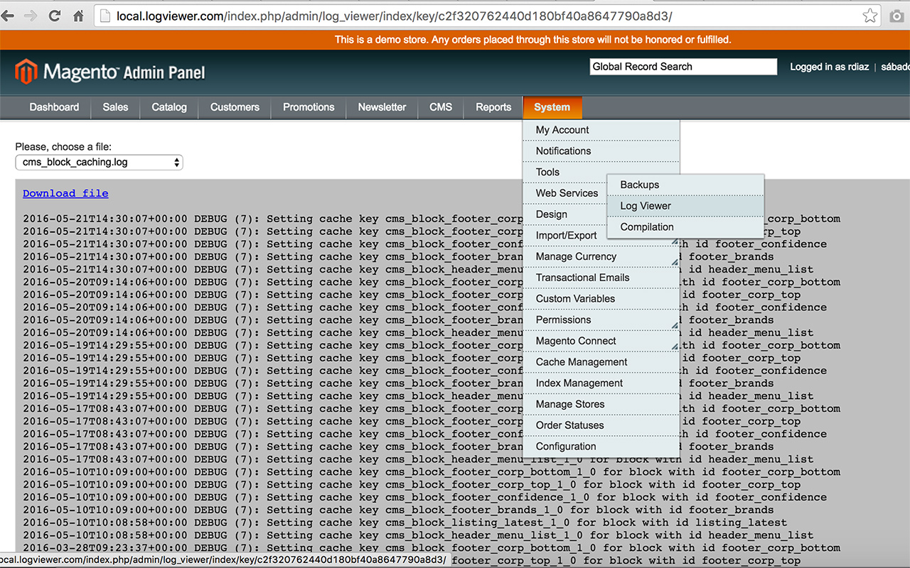

# Magento 1.x Log Viewer
[](https://travis-ci.org/diazwatson/LogViewer)

This simple extension allows you to view log files from admin panel.


# Installation 

## Using Modman

- Make sure you have [Modman](https://github.com/colinmollenhour/modman) installed
- Allow symlinks for the templates directory (required for installations via Modman)
    - Use n98-magerun like pro: `n98-magerun.phar dev:symlinks`
    - Or just set **'Allow Symlinks'** to **'Yes'** in **System - Configuration / Advanced / Developer / Template Settings**

- Install Log Viewer module:
```bash
cd [magento root folder]
modman init
modman clone git@github.com:diazwatson/LogViewer.git
```
- Flush Magento's cache 

### How to update
With modgit you can effortlessly grab latest changes from github.
```
cd [magento root folder]
modgit update logviewer
```
- Flush Magento's cache


## Using Modgit

- Make sure you have [Modgit](https://github.com/jreinke/modgit) installed

- Install Log Viewer module:
```bash
cd [magento root folder]
modgit init
modgit clone git@github.com:diazwatson/LogViewer.git
```
- Flush Magento's cache 

### How to update
With modman you can effortlessly grab latest changes from github.
```
cd [magento root folder]
modman update logviewer
```
- Flush Magento's cache

# How to use
Once installed go to **System - Tools - Log Viewer**

